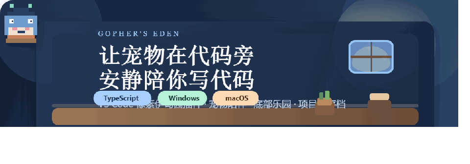
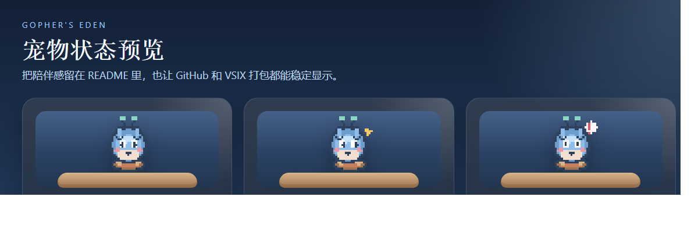

# Gopher's Eden

<p align="center">
  
</p>

<p align="center">
  
  
  
  
</p>

> 一个给 VS Code 用的开发者像素伊甸园插件。
> 它会在不打扰编码的前提下，让宠物、家具、成长反馈和底部乐园一起陪你工作。

## 这一版重点

- 4 个基础族群：`Primitives`、`Concurrency`、`Protocols`、`Chaos`
- 3 个成长阶段：`初生期`、`成长期`、`成熟期`
- 手动切换种族：可以在侧边栏直接改种族，手动选择优先于自动判定
- 种族来源持久化：自动判定或手动选择都会写入项目级 `.vscode/eden.json`
- 成长信息区补全：显示当前种族、当前阶段、成长值、距离下一阶段、当前种族说明、阶段解锁能力说明
- 成长来源更完整：写代码、保存成功、逗玩、购买家具、摆放家具都会累积成长值；连续稳定保存还会得到额外成长奖励

## 宠物状态预览

<p align="center">
  
</p>

## 系统结构

- 种族 = 出身 / 性格底色：决定它天生的动作节奏、偏好家具、视觉倾向和行为反应。
- 成长 = 发育 / 陪伴深度：决定它现在长到什么程度，影响体型、动作丰富度、空间联动能力和庆祝强度。
- 最终表现 = 种族基底 × 成长阶段。

## 成长阶段

| 阶段 | 成长值 | 用户能看到的区别 |
| --- | --- | --- |
| 初生期 | 0 - 99 | 体型最小、轮廓最圆、细节最少，动作轻，家具联动弱 |
| 成长期 | 100 - 299 | 体型略大、细节更完整，开始有明确家具偏好，报错会找掩体 |
| 成熟期 | 300+ | 体型最大、行为最完整，家具联动最强，庆祝和互动反馈最丰富 |

## 基础族群

| 族群 | 项目特征 | 性格与动作 | 偏好家具 |
| --- | --- | --- | --- |
| Primitives / 原型派 | 基础类型、简单分支、直接结构更多 | 最亲和、动作圆润、反应温和 | 长椅、树 |
| Concurrency / 并发派 | `go`、`chan`、并发相关关键词更多 | 轻快、灵动、节奏最快 | 台灯、草地 |
| Protocols / 协议派 | `struct`、`interface`、抽象接口和结构化代码更多 | 稳定、克制、秩序感更强 | 钢琴、台灯 |
| Chaos / 混沌派 | 报错多、嵌套深、`switch` 和复杂条件更多 | 戏剧性更强，警觉反应最大 | 树、长椅 |

## 这版已经实现的成长闭环

- 首次进入项目时，会扫描当前工程代码特征并对 4 个族群打分，自动确定基础种族。
- 用户可以在侧边栏手动切换种族；手动改过之后不会再被自动覆盖。
- 如果想重新按项目特征判断，可以点侧边栏里的“重新自动判定”。
- 成长值会随着写代码、无错误保存、逗玩、购买家具、摆放家具而累积。
- 每连续 5 次稳定保存，会额外获得一笔“稳定开发奖励成长值”。
- 成长阶段会跟着成长值自动切换，并立刻影响视觉尺寸、动作节奏、家具联动能力和提示文案。

## 当前能看见的差异

- 外观差异：阶段会影响尺寸和光环细节，族群会影响色彩、滤镜和底座风格。
- 动作差异：不同族群的 idle / working / alert 节奏不同，Chaos 会更不稳定，Concurrency 最轻快。
- 行为差异：不同族群偏好不同家具，成长期和成熟期会更明显地靠近偏好家具或在报错时寻找掩体。
- UI 差异：侧边栏会明确显示“当前种族 + 来源 + 当前阶段 + 成长值 + 距离下一阶段 + 阶段解锁能力”。
- 空间联动差异：成熟阶段的家具联动和保存庆祝最明显，初生期最克制。

## 快速开始

### 1. 安装依赖

```bash
npm install
```

### 2. 编译插件

```bash
npm run compile
```

### 3. 本地调试运行

在当前项目根目录用 VS Code 打开后：

1. 按 `F5`
2. 打开新的 `Extension Development Host`
3. 在左侧活动栏找到 `Gopher 乐园`
4. 打开 `伊甸面板` 和底部 `Gopher 底部乐园`

## 打包给朋友玩

项目已经提供一键打包命令：

```bash
npm run package
```

执行后会在根目录生成类似下面的文件：

```bash
gophers-eden-0.5.0.vsix
```

你的朋友可以在 VS Code 中这样安装：

1. 打开扩展面板
2. 点击右上角 `...`
3. 选择 `从 VSIX 安装...`
4. 选中生成的 `.vsix` 文件

如果还想把当前项目里的宠物名、资源数、种族、成长阶段和家具布局一起分享过去，请把项目中的 `.vscode/eden.json` 一起发给对方。

## 项目存档内容

当前状态保存在：

```bash
.vscode/eden.json
```

至少会持久化这些内容：

- 主题
- 宠物名
- 宠物族群
- 种族来源（自动 / 手动）
- 成长值 / 当前成长阶段 / 保存次数
- 资源数
- 背包
- 已摆放家具
- 代码区宠物显示开关
- 代码区宠物大小

## 已实现的核心模块

- Sidebar Webview：宠物卡、资源面板、成长信息、手动种族切换、背包、商店、已摆放管理
- Bottom Dock Webview：宠物主舞台、家具拖动、舞台管理
- Editor Decoration Layer：代码区宠物轻量投影、家具跟行 / 浮层模式
- Project State Store：`.vscode/eden.json` 项目级存档
- Resource Engine：有效代码统计、`.gitignore` 过滤、奖励结算
- Lineage Engine：项目启发式扫描、4 族群评分、手动切换优先、重新自动判定
- Growth Engine：3 阶段成长、阶段差异、保存庆典、错误逃逸、家具联动

## 技术栈

- VS Code Extension API
- TypeScript
- WebviewViewProvider
- TextEditorDecorationType
- Project-level JSON persistence

## 仓库结构

```text
.
├─ media/                 # 宠物、家具、Webview 样式与脚本
├─ src/                   # 插件核心逻辑
├─ dist/                  # TypeScript 编译输出
├─ .vscode/eden.json      # 项目级存档（运行后生成）
├─ package.json
└─ README.md
```

## 开发命令

```bash
npm run compile
npm run watch
npm run package
```

## 小愿景

Gopher's Eden 不是要让宠物占领代码区，而是想让它在不牺牲编辑体验的前提下，给开发者一点轻盈、可爱和持续被陪伴的感觉。
