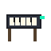

# Gopher's Eden

<p align="center">
  
</p>

<p align="center">
  
  
  
  
</p>

> 一个给 VS Code 用的“开发者像素伊甸园”插件。  
> 它会在不打扰编码的前提下，让宠物和家具在编辑器边缘、侧边栏和底部乐园里陪你一起工作。

## 功能亮点

- 轻量代码区宠物投影：优先保证不挡代码，条件合适时才显示在编辑器右侧安全区。
- 底部 `GOPHER 乐园`：宠物和家具的主要互动舞台，可以拖动、整理、收纳。
- 项目级存档：状态写入 `.vscode/eden.json`，换个项目就是另一座伊甸园。
- 资源养成：写代码能获得碎砖与露珠，用来购买家具。
- 背包 / 商店 / 已摆放管理：支持购买、摆放、收回背包、一键整理。
- 宠物互动：支持改名、逗玩、状态切换、轻量反馈动画。
- 多语言资源统计：当前支持 `Go` 和 `Java` 的有效代码行统计。

## 氛围预览

<table>
  <tr>
    <td align="center">
      
      <br />
      <strong>Normal</strong>
      <br />
      <sub>平静陪伴</sub>
    </td>
    <td align="center">
      
      <br />
      <strong>Working</strong>
      <br />
      <sub>写代码时更精神</sub>
    </td>
    <td align="center">
      
      <br />
      <strong>Alert</strong>
      <br />
      <sub>报错时会受惊</sub>
    </td>
  </tr>
</table>

<table>
  <tr>
    <td align="center"><br /><strong>钢琴</strong></td>
    <td align="center"><br /><strong>长椅</strong></td>
    <td align="center"><br /><strong>盆栽</strong></td>
    <td align="center"><br /><strong>台灯</strong></td>
    <td align="center"><br /><strong>小游戏机</strong></td>
  </tr>
</table>

## 当前体验边界

- 编辑器区域是工作区，宠物只是轻量陪伴投影，不做自由拖拽。
- 真正的拖拽、摆放、收纳、互动，统一放在侧边栏和底部乐园完成。
- 代码多、长行密集或右侧安全区不足时，代码区宠物允许静默隐藏。
- 产品优先级始终是：`绝不打扰编码 > 尽量显示宠物`。

## 快速开始

### 1. 安装依赖

```bash
npm install
```

### 2. 编译插件

```bash
npm run compile
```

### 3. 本地调试运行

在当前项目根目录用 VS Code 打开后：

1. 按 `F5`
2. 打开新的 `Extension Development Host`
3. 在侧边栏找到 `Gopher 乐园`
4. 打开底部 `GOPHER 乐园` 面板开始体验

## 打包给朋友玩

项目已经提供一键打包命令：

```bash
npm run package
```

执行后会在根目录生成一个类似下面的文件：

```bash
gophers-eden-0.2.0.vsix
```

你的朋友可以在 VS Code 中这样安装：

1. 打开扩展面板
2. 点击右上角 `...`
3. 选择 `从 VSIX 安装...`
4. 选中生成的 `.vsix` 文件

如果还想把你当前项目里的宠物名、资源数、家具布局一起分享给朋友，请把项目中的 `.vscode/eden.json` 一起发过去。

## 项目存档

当前状态保存在：

```bash
.vscode/eden.json
```

至少会持久化这些内容：

- 主题
- 宠物名
- 资源数
- 背包
- 已摆放家具
- 代码区宠物显示开关
- 代码区宠物大小

## 已实现的核心模块

- `Sidebar Webview`
  - 宠物卡
  - 资源面板
  - 背包
  - 商店
  - 已摆放管理
- `Bottom Dock Webview`
  - 宠物主舞台
  - 家具拖动
  - 舞台管理
- `Editor Decoration Layer`
  - 代码区宠物轻量投影
  - 家具跟行 / 浮层模式
- `Project State Store`
  - `.vscode/eden.json` 项目级存档

## 技术栈

- VS Code Extension API
- TypeScript
- WebviewViewProvider
- TextEditorDecorationType
- Project-level JSON persistence

## 仓库结构

```text
.
├─ media/                 # 宠物、家具、Webview 样式与脚本
├─ src/                   # 插件核心逻辑
├─ dist/                  # TypeScript 编译输出
├─ .vscode/eden.json      # 项目级存档（运行后生成）
├─ package.json
└─ README.md
```

## 开发命令

```bash
npm run compile
npm run watch
npm run package
```

## 小愿景

Gopher's Eden 不是要让宠物占领代码区，而是想让它在不牺牲编辑体验的前提下，给开发者一点轻盈、可爱和秩序感。

如果你也喜欢“边写代码边养小世界”的感觉，欢迎继续把它养大。
